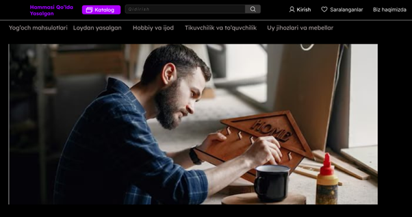

# Texnik-Topshiriq

 

Qo’lda yasalgan buyumlar savdosi bilan shug’ullanuvchi <strong>“Hammasi qo’lda yasalgan”</strong> veb saytini yaratish uchun <strong>TEXNIK TOPSHIRIQ</strong>
  
  
<strong text-center >Hujjat Tarkibi :</strong> 
<strong>●	Umumiy ma’lumot</strong> 
<ul>
<li>○	Platformaning to‘liq nomi va uning ahamiyati</li>
<li>○	Buyurtmachi</li>
<li>○	Bajaruvchi</li>
<li>○	Loyihani yaratish uchun asos</li>
<li>○	Davomiyligi (Boshlanish va Tugash sanalari)</li>
</ul>
<strong>●	Saytni yaratish maqsadi va vazifalari</strong>
<ul>
<li>○	Platformani yaratishdan maqsad</li>
<li>○	Platformaning vazifalari</li>
</ul>
<strong>●	Sayt talablari</strong>
<ul>
<li>○	Saytga qo'yiladigan umumiy talablar</li>
<li>○	Platforma tuzilishi va funksionalligiga qo‘yiladigan talablar</li>
<li>○	Uchinchi tomon axborot tizimlari bilan o'zaro hamkorlik talabi</li>
<li>○	Xavfsizlik talablari</li>
</ul>
<strong>●	Tizimning hayot aylanishiga texnik xizmat ko'rsatish, ta'mirlash va texnik xizmat ko'rsatish talablari</strong> 
<strong>●	Veb-interfeysning funksionalligiga qo'yiladigan talablar</strong> 
<strong>●	Rollar va kirish talablari</strong> 
<strong>●	UML diagrammalar</strong> 
<strong>●	Saytning tuzilishi va sahifalar tarkibi</strong>  
<strong>●	Ma’lumotlar bazasining tuzilmasi</strong> 
<strong>●	ER diagrammasi</strong> 
<strong>●	Platformani nazorat qilish va qabul qilish tartibi</strong>  
<strong>●	Hujjatlashtirish talablari</strong> 
    
<strong>Documentni [.doc] formatda yuklab olishingiz mumkin</strong>

